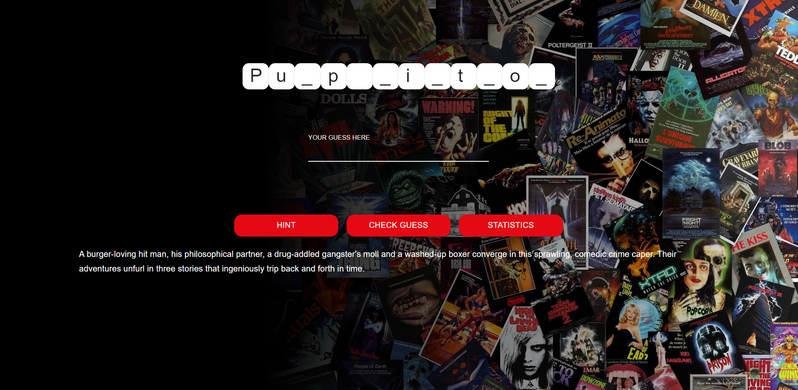
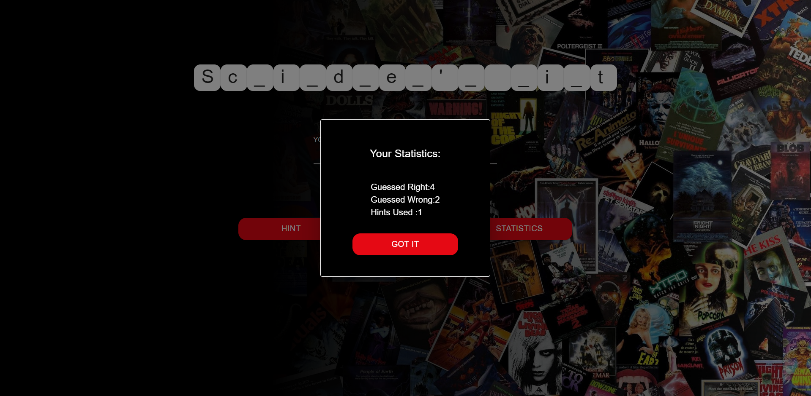
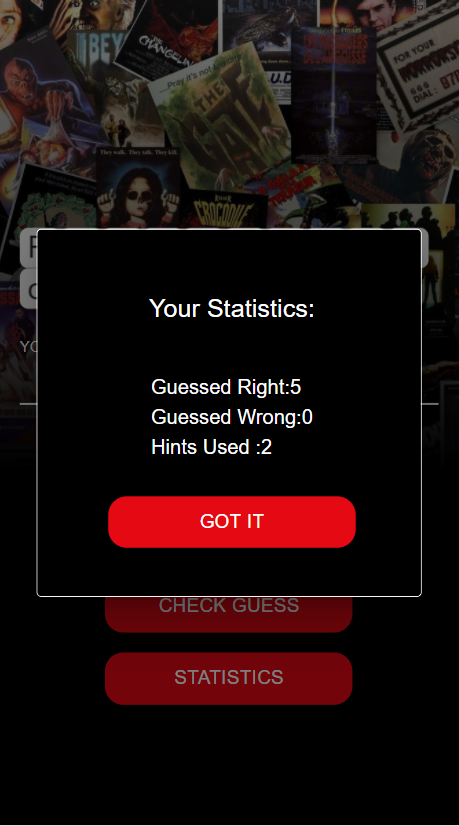

# Guess the TV show name

Deployed on Netlify : https://guess-the-tvshow.netlify.app/

## Motivation

I have built this project as a challange after learning TypeScript to implement my newly accuired knowledge and to practice timely completion of Front-End web developer's home assignment

## Description

The goal of the game is to guess a TV show name.
The player sees a TV name with missing letter and should guess and fill the given TV show name,If the guess is successfull,the player gets a point and if not looses a life point
The player has 3 life point,if the player lost all life points the game is over and can be started again
A "HINT" button can be pressed to get a hint regarding the TV show the player is stuck on
.

## API used

https://developers.themoviedb.org
fetched the data from:
https://developers.themoviedb.org/3/tv/get-top-rated-tv

## Technologies used

Created with create-react-app and used the following libraries

- React (17.0.2)
- React-router-dom
- Material-ui
- TypeScript

## Usage

To run this project locally

### `npm install`

Installs dependencies

### `npm run start`

Runs the app on the local server. 
Opens http://localhost:3000

## Screenshots

Web

  
      
      
      
      

Mobile

  
      
      
      
      

